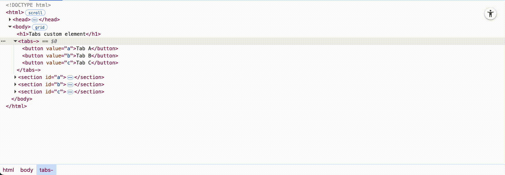

# Tabs custom element

A minimal tabs custom element that tries to work exactly according to [ARIA Authoring Practices Guide (APG) Tabs Pattern](https://www.w3.org/WAI/ARIA/apg/patterns/tabs/).

No build, no dependencies, no styles, no shadow dom. About 3.2k as is, less than 1k compressed.

[Demo](https://sakamies.github.io/tabs-customelement/)

## Usage

[Import the script](https://developer.mozilla.org/en-US/docs/Web/JavaScript/Reference/Statements/import) into your document and [register the element](https://developer.mozilla.org/en-US/docs/Web/API/Web_components/Using_custom_elements#registering_a_custom_element). Use any tag name you like. For small projects without the need for namespacing and such, I prefer `tabs-`.

```html
<script type="module">
  import {TabsElement} from '/tabs.js'
  customElements.define('tabs-', TabsElement)
</script>
```

- Wrap some buttons with a `<tabs->` element.
- Make some elements with id's. (Doesn't have to be `<section>` elements, just seemed appropriate here.)
- Target those id's with a `value` attribute on your buttons.

```html
<tabs->
  <button value="tab-a-id">Tab A</button>
  <button value="tab-b-id">Tab B</button>
</tabs->
<section id="tab-a-id">Tab A content</section>
<section id="tab-b-id">Tab B content</section>
```

The tabs element upgrades the DOM with all the necessary attributes and event listeners.



The example in `index.html` has minimal styling, but the elements are just buttons and sections, so style however fits your project. Inspect the elements with devtools to see what attributes are added to the buttons and sections. There is no hidden state, just attributes.

You can use wrappers for the buttons or really any html inside `<tabs->` if you need to. The tabs element only cares that there are some buttons with values inside somewhere, and that there are elements that have ids that match those values somewhere.

## Choose which tab is initially selected

Add `aria-selected="true"` to your selected tab.

```html
<tabs->
  <button value="tab-a-id">Tab A</button>
  <button aria-selected="true" value="tab-b-id">Tab B</button>
</tabs->
```

## Attributes

### `aria-orientation`

A standard aria attribute that applies to tabs. Set `aria-orientation="vertical"` if you are styling the tab buttons to have a vertically stacked layout. This will have up & down arrows change tabs instead of left & right.

### `manual-activation`

You can set `manual-activation"` if you don't want the tabs to change immediately on arrow key press. This means that tab buttons will get focused when you press arrow keys, but you will need to press Space or Enter to activate the focused tab.

## Events

When changing a tab, the tabs element will dispatch an event with the element name. If you named your tabs element `<tabs->`, then the event you listen to will be `tabs-`.

The event gets the selected tab and panel in its [`detail`](https://developer.mozilla.org/en-US/docs/Web/API/CustomEvent/detail) property.

The event is cancellable with `event.preventDefault()`. When preventing default, you get the tab and panel, but the tab will not change.

```js
document.addEventListener('tabs-', event => {
  console.log(event.detail.tab, event.detail.panel)
  event.preventDefault()
})
````

## Accessibility

The tabs element will handle all interactivity and attributes for you, but you should still be mindful with your markup.

### HTML structure

You really really should only include tab buttons inside tabs and have your panels in order right after the tabs. That's not strictly required or enforced though. It's just that users (especially screen reader users, but everybody really) expect tabs to be sequential buttons and tab panels to come right after the tabs. If you need some links or action buttons on the same row as the tabs or something like that, have those buttons come before the tabs in the html and use css to position them as you need to.

Screen readers and keyboard users might have functionality to jump from the tab button to the tab panel and back, but there's no guarantee of that unless you're making a tailored app for power users only.

Here's an example.

```html
<div class="toolbar">
  <button>Toolbar button X</button>
  <tabs->
    <button value="a">Tab A</button>
    <button value="a">Tab B</button>
  </tabs->
  <!-- Avoid putting anything here, between the tabs and panels. -->
</div>
<!-- Avoid putting anything here, between the tabs and panels. -->
<section id="a"></section>
<section id="b"></section>
```

### Interactive content inside tab panels

If you have a link, button, or some other focusable element inside your panel, you might rarely take the tab panel itself from the focus order. Be wary that in this case it should be obvious for keyboard and screen reader users that they have focused into a tab. It's safest and most consistent to go with the default that all panels are focusable. If you need to, you can take a panel out of the focus order in the standard way of setting `tabindex="-1"`. The tabs element will not unnecesarily overwrite attributes you have set.

```html
<tabs->
  <button value="a">Tab A</button>
  <button value="b">Tab B</button>
</tabs->
<section id="a"></section>
<section id="b" tabindex="-1">
  <a href="/link">A link at the beginning of the tab</a>
</section>
```

### Disabled tabs

You can disable tabs the standard way of setting the `disabled` attribute. You should avoid this though, since disabled buttons will not be communicated to screen readers in any way. Users with normal sight might now there's a disabled tab there, but screen reader users probably won't.

```html
<tabs->
  <button value="a">Tab A</button>
  <button disabled value="b">Tab B</button>
</tabs->
<section id="a"></section>
<section id="b"></section>
```

### Why not more custom elements?

```html
<tabs->
  <tab->Tab A<tab->
  <tab->Tab B<tab->
</tabs->
<tab-panel></tab-panel>
```

Well a tab _is a button_ and is specified to work like a button and browsers give all the basic interactivity and style hooks for free. So it really should be a `<button>`. Making any kind of [custom clickable elements](https://www.deque.com/blog/accessible-aria-buttons/) is a big amount of useless extra work. It should only really be done if you're super stuck with a legacy system that can't do buttons for some archaic reason.

A `<tab-panel>` like element might make a smidge more sense, but it's just a generic container that gets its role overridden as `role=tabpanel` anyway, so didn't see any reason to.

## Progressive enhancement

There's a tradeoff to consider. You can set the `hidden` attribute on your non-selected tab panel elements so only the initially selected tab is visible before any scripts or styles load. If scripts fail to load though, your user won't see all the tabs, just the initial tab. This might be a good tradeoff for a smoother looking page load or if you're relying a lot on javascript anyway. If you're considering slower or less reliable networks, lower end devices or any other kind of scenario where getting the content is more important than absolutely smooth presentation, then having all the tabs be visible initially and only being hidden after scripts have successfully completed loading might be the better option.

If you keep your page weight low and the tabs are not right at the top of the page, having them all initially visible is probably just fine and the more robust option for everybody.

----

## Licence, NPM module?

This repo is more of a journey of learning and writing, not necessarily meant as a participant in the packages & components ecosystem. Though I've tried to make this airtight and it should be fully production ready — *and I am using it in production* — I'm not promising anything.

This repo does not have a licence and is [not on NPM](https://htmx.org/essays/vendoring/). You do not have my permission for anything, but I hope your rebel spirit will let you learn from this, to code your own and make a package. Give credit and [behave](https://www.contributor-covenant.org).